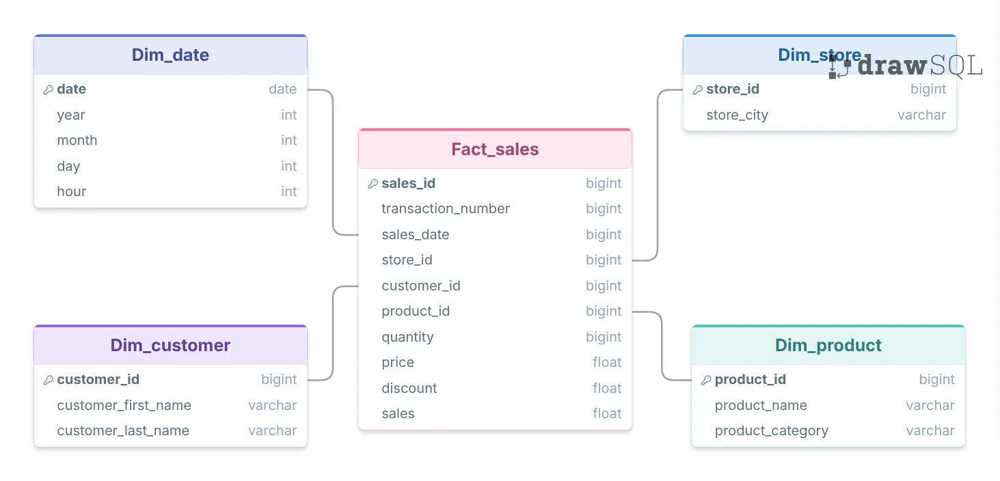
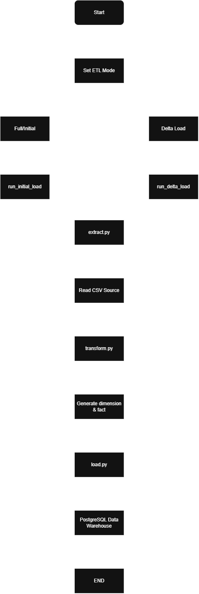

# Grocery Sales Data Warehouse - ETL Pipeline

## 📌 Project Overview

This project implements an **End-to-End ETL Pipeline** to build a Grocery Sales Data Warehouse using **Python and PostgreSQL**.

The objective of this project is to transform raw transactional data into a structured **Star Schema Data Warehouse** that supports analytical queries.

This project demonstrates:

* Data extraction from CSV files
* Data transformation into dimension and fact tables
* Data warehouse implementation using Star Schema
* Full reload processing
* Initial load and incremental (delta) load simulation
* ETL performance comparison between full reload and delta load

---

# 🏗️ Data Warehouse Architecture

The data warehouse follows a **Star Schema** design consisting of dimension tables and a central fact table.

## Dimension Tables

### dim_customer

Stores customer information.

Columns:

* customer_id
* first_name
* last_name

### dim_product

Stores product information.

Columns:

* product_id
* product_name
* category
* sub_category

### dim_store

Stores store information.

Columns:

* store_id
* store_city

### dim_date

Stores date-related attributes.

Columns:

* date_id
* date
* year
* month
* day
* hour

## Fact Table

### fact_sales

Stores transactional sales data.

Columns:

* sales_id
* transaction_number
* sales_date
* store_id
* customer_id
* product_id
* price
* quantity
* discount
* sales

## Star Schema Diagram



---

# 🔄 ETL Workflow

The ETL pipeline consists of three main stages:

## 1. Extract

The pipeline extracts transaction data from CSV files.

Source files:

* `grocery_sales.csv` → Full Reload
* `initial_load_data.csv` → Initial Load
* `delta_load_data.csv` → Delta Load

## 2. Transform

The transformation process includes:

* Data cleaning
* Column standardization
* Creating dimension tables
* Creating fact table
* Generating date dimension

## 3. Load

The processed data is loaded into PostgreSQL Data Warehouse.

Database schemas:

* `dwh` → Data Warehouse layer
* `datamart` → Summary and analytical layer

## ETL Flow Diagram



---

# 📂 Project Structure

```text
grocery-sales-datawarehouse/

├── data/
│   ├── grocery_sales.csv
│   ├── initial_load_data.csv
│   └── delta_load_data.csv
│
├── docs/
│   ├── etl_flow.png
│   └── star_schema.png
│
├── notebooks/
│   ├── full_reload.ipynb
│   ├── initial_load_process.ipynb
│   └── delta_load_process.ipynb
│
├── scripts/
│   ├── config.py
│   ├── ddl.py
│   ├── extract.py
│   ├── transform.py
│   ├── load.py
│   ├── initial_load.py
│   └── delta_load.py
│
├── requirements.txt
└── README.md
```

---

# 🚀 ETL Execution Scenario

## Full Reload

Full reload simulates rebuilding the warehouse by loading the complete dataset.

Process:

```text
Drop Existing Tables
        |
        v
Run DDL
        |
        v
Read grocery_sales.csv
        |
        v
Transform Data
        |
        v
Load Data Warehouse
```

Notebook:

```
full_reload.ipynb
```

Mode:

```
full
```

---

## Initial Load

Initial load simulates the first population of the data warehouse before incremental updates.

Process:

```text
Drop Existing Tables
        |
        v
Run DDL
        |
        v
Read initial_load_data.csv
        |
        v
Transform Data
        |
        v
Load Data Warehouse
```

Notebook:

```
initial_load_process.ipynb
```

Mode:

```
initial
```

---

## Delta Load

Delta load simulates incremental data ingestion by processing only newly arrived transaction data.

Process:

```text
Existing Warehouse
        |
        v
Read delta_load_data.csv
        |
        v
Transform New Data
        |
        v
Append to Warehouse
```

Notebook:

```
delta_load_process.ipynb
```

Mode:

```
delta
```

---

# ⏱️ ETL Performance Comparison

Execution time was measured using Python `time.perf_counter()`.

| Process     | Dataset                                      | Execution Time |
| ----------- | -------------------------------------------- | -------------: |
| Full Reload | Complete dataset (`grocery_sales.csv`)       |   8.80 seconds |
| Delta Load  | New transaction data (`delta_load_data.csv`) |   0.23 seconds |

Delta load performance improvement:

* Approximately **38x faster** than full reload
* Approximately **97.4% reduction in execution time**

This improvement occurs because delta load only processes newly arrived data instead of rebuilding the entire warehouse.

---

# 🛠️ Technology Stack

| Technology       | Usage                   |
| ---------------- | ----------------------- |
| Python           | ETL Processing          |
| Pandas           | Data Transformation     |
| PostgreSQL       | Data Warehouse Database |
| Psycopg2         | Database Connection     |
| Jupyter Notebook | ETL Execution           |
| DBeaver          | Database Management     |

---

# 🔮 Future Improvements

Possible improvements:

* Automate ETL scheduling using Apache Airflow
* Add ETL logging and monitoring
* Implement automated data quality checks
* Add cloud deployment
* Improve database configuration management

---

# 👤 Author

**Zaky Rayadhi**

Data Analyst | Python | SQL | Data Warehouse

GitHub:
https://github.com/zakyrayadhi
